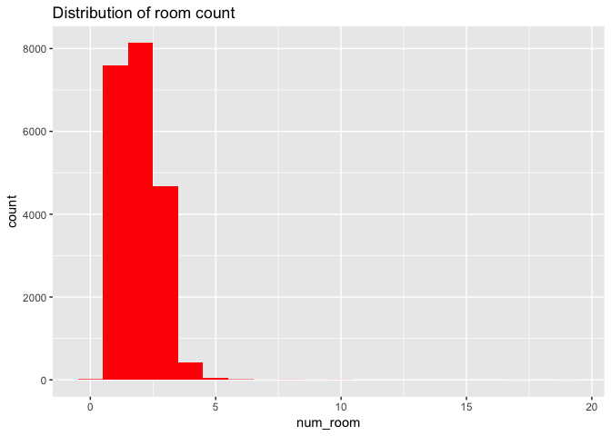
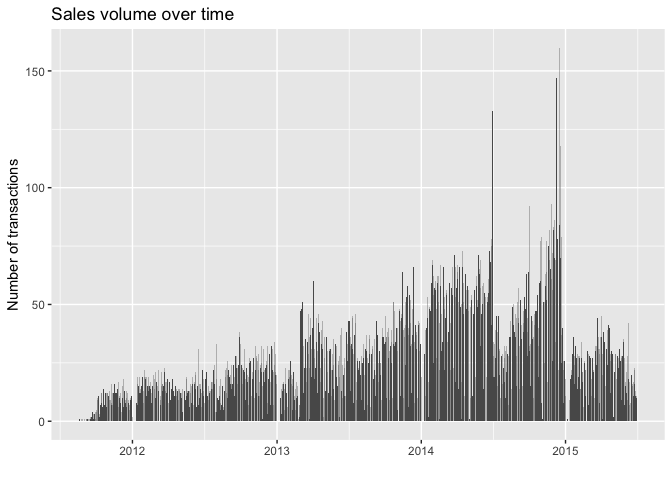
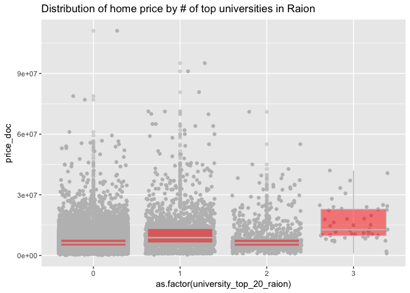
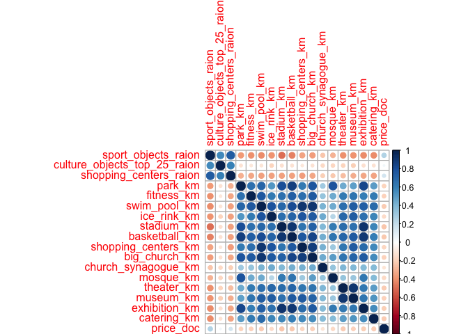
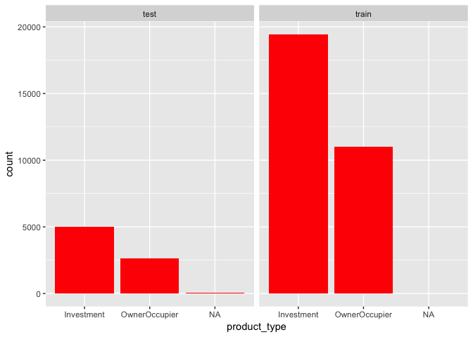

Russian Housing Analysis
================

This is an extremely rich data set with features that are not anonymized, so it makes an excellent playground for exploratory data analysis. Between the train data and the macro data there are hundreds of variables. Although we obviously can't explore everything, I want to cover as much as is possible and interesting.

Training Data

-   [Missing Data](#missing)
-   [Data Quality Issues](#quality)
-   [Internal Home Features](#internal)
-   [Demographic Features](#demographic)
-   [Education Features](#school)
-   [Cultural/Recreational Features](#culture)
-   [Infrastructure Features](#infrastructure)
-   [Variable Importance](#importance)

Train/Test Comparison

-   [Missing Data](#missing_test)
-   [Internal Features](#internal_test)

``` r
library(data.table)
library(tidyverse)
library(lubridate)
library(scales)
library(corrplot)
library(DT)
```

Training Data
=============

``` r
dtrain <- fread('../data/train.csv', stringsAsFactors=TRUE)
```

Missing Data
------------

How much data is missing?

``` r
miss_pct <- map_dbl(dtrain, function(x) { round((sum(is.na(x)) / length(x)) * 100, 1) })

miss_pct <- miss_pct[miss_pct > 0]

data.frame(miss=miss_pct, var=names(miss_pct), row.names=NULL) %>%
ggplot(aes(x=reorder(var, -miss), y=miss)) +
geom_bar(stat='identity', fill='red') +
labs(x='', y='% missing', title='Percent missing data by feature') +
theme(axis.text.x=element_text(angle=90, hjust=1))
```


Of 292 columns, 51 have missing values. The percentage of values missing ranges from 0.1% in metro\_min\_walk to 47.4% in hospital\_beds\_raion.

Data Quality Issues
-------------------

Below I am fixing a number of data issues in train.csv which have been brought up by others in the forums or that I have discovered.

``` r
# state should be discrete valued between 1 and 4. There is a 33 in it that is cleary a data entry error
# Lets just replace it with the mode.
dtrain$state[dtrain$state == 33] <- which.max(table(dtrain$state))

# build_year has an erronus value 20052009. Since its unclear which it should be, let's replace with 2007
dtrain$build_year[dtrain$build_year == 20052009] <- 2007
```

Housing Internal Characteristics
--------------------------------

Let's look for correlation among the internal home characteristics and price.

``` r
# variables that are internal to home
internal_chars <- c('full_sq', 'life_sq', 'floor', 'max_floor', 'build_year', 'num_room',
'kitch_sq', 'state', 'price_doc')

corrplot(cor(dtrain[, ..internal_chars], use="complete.obs"))
```


### Area of Home and Number of Rooms

We saw earlier that full\_sq is correlated with price. Let's take a closer look.

``` r
ggplot(aes(x=full_sq, y=price_doc), data=dtrain) +
geom_point(color='red')
```


There is an outlier in full\_sq. Its not clear whether this is an entry error. For now, remove it.

``` r
dtrain %>%
filter(full_sq < 2000) %>%
ggplot(aes(x=full_sq, y=price_doc)) +
geom_point(color='red', alpha=0.5) +
labs(x='Area', y='Price', title='Price by area in sq meters')
```


The feature full\_sq is defined in the data dictionary as 'total area in square meters, including loggias, balconies and other non-residential areas' and the life\_sq is defined as 'living area in square meters, excluding loggias, balconies and other non-residential areas.' So it should be the case that life\_sq is always less than full\_sq.

``` r
sum(dtrain$life_sq > dtrain$full_sq, na.rm=TRUE)
```

    ## [1] 37

There are 37 observations where life\_sq is greater than full\_sq.

Let's look at num\_rooms.

``` r
table(dtrain$num_room)
```

    ## 
    ##    0    1    2    3    4    5    6    7    8    9   10   17   19 
    ##   14 7602 8132 4675  418   40    9    1    3    1    2    1    1

``` r
ggplot(aes(x=num_room), data=dtrain) +
geom_histogram(fill='red', bins=20) +
ggtitle('Distribution of room count')
```

    ## Warning: Removed 9572 rows containing non-finite values (stat_bin).



A vast majority of the apartments have three rooms or less.

### Sale Type

Is there a significant difference in price for homes bought by an owner-occupier or homes bought for investment?

``` r
ggplot(aes(x=price_doc), data=dtrain) +
geom_density(fill='red', color='red') +
facet_grid(~product_type) +
scale_x_continuous(trans='log')
```


``` r
dtrain %>% group_by(product_type) %>% summarize(median(price_doc))
```

    ## # A tibble: 2 x 2
    ##    product_type `median(price_doc)`
    ##          <fctr>               <dbl>
    ## 1    Investment             6670000
    ## 2 OwnerOccupier             5564090

It's not clear from the density plots, but homes sold for investment sell for more than homes sold to owner-occupiers.

### Build Year

Let's take a look at build\_year:

``` r
table(dtrain$build_year)
```

    ## 
    ##    0    1    3   20   71  215 1691 1860 1876 1886 1890 1895 1896 1900 1904 
    ##  530  368    2    1    1    1    1    2    1    1    5    1    2    2    1 
    ## 1905 1906 1907 1910 1911 1912 1914 1915 1917 1920 1924 1925 1926 1927 1928 
    ##    1    1    2    5    1    5    3    5   16    1    3    1    8   10   12 
    ## 1929 1930 1931 1932 1933 1934 1935 1936 1937 1938 1939 1940 1941 1943 1946 
    ##   12    6    6    8    7   13   11    5   10    9    7   14    2    2    2 
    ## 1947 1948 1949 1950 1951 1952 1953 1954 1955 1956 1957 1958 1959 1960 1961 
    ##    4    1    3   22   23   45   24   36   52   48  119  179  208  344  297 
    ## 1962 1963 1964 1965 1966 1967 1968 1969 1970 1971 1972 1973 1974 1975 1976 
    ##  338  325  315  378  348  384  389  407  418  352  360  333  357  309  263 
    ## 1977 1978 1979 1980 1981 1982 1983 1984 1985 1986 1987 1988 1989 1990 1991 
    ##  260  235  236  226  189  189  185  169  178  131  171  155  155  129   93 
    ## 1992 1993 1994 1995 1996 1997 1998 1999 2000 2001 2002 2003 2004 2005 2006 
    ##  139  115  160  149  162  139  141  125  130  177  214  193  220  176  242 
    ## 2007 2008 2009 2010 2011 2012 2013 2014 2015 2016 2017 2018 4965 
    ##  220  234  176  132  162  233  464  919  824  375  154    1    1

There are a number of nonsensical years - 0, 1, 3, 20, 71, 215, 2018, and 4965. The 1691 I guess is possible. In another kernel, I plan on setting these to NA and using the mice package to impute these values. For now, let's limit our visualizations to the reasonable years:

``` r
dtrain %>%
filter(build_year > 1691 & build_year < 2018) %>%
ggplot(aes(x=build_year)) +
geom_histogram(fill='red') +
ggtitle('Distribution of build year')
```


The distribution appears bimodal with a peak somewhere in the early 1970s and somewhere in the past few years.

Now let's see if build\_year and prices are related. Here I group the data by year and take the mean of price\_doc.

``` r
dtrain %>%
filter(build_year > 1691 & build_year < 2018) %>%
group_by(build_year) %>%
summarize(mean_build_price=mean(price_doc)) %>%
ggplot(aes(x=build_year, y=mean_build_price)) +
geom_line(stat='identity', color='red') +
geom_smooth(color='darkgrey') +
ggtitle('Mean price by year of build')
```


The relationship appears somewhat steady over time, especially after 1960. There is some volatility in the earlier years. This is not a real effect but simply due to the sparseness of observations until around 1950.

### Timestamp

How does the sale price vary over the time horizon of the data set? Here I just group by the day and caclulate the median price for each day and plot it over time.

``` r
dtrain$timestamp <- as.Date(dtrain$timestamp)

dtrain %>%
group_by(timestamp) %>%
summarize(med_price = median(price_doc)) %>%
ggplot(aes(x = timestamp, y = med_price)) +
geom_line(color = 'red') +
geom_smooth(method = 'lm', color = 'grey', alpha = 0.7) +
ggtitle('Daily median price over time')
```


And to compare with the above plot, here is the volume of sales over the same time.

``` r
dtrain %>%
group_by(timestamp) %>%
summarize(n = n()) %>%
ggplot(aes(x = timestamp, y = n)) +
geom_bar(stat = 'identity') +
labs(x='', y='Number of transactions', title='Sales volume over time')
```



Is there a seasonal component to home prices in the course of a year?

``` r
dtrain %>%
mutate(month=month(timestamp)) %>%
group_by(month) %>%
summarize(med_price=median(price_doc)) %>%
ggplot(aes(x=as.integer(month), y=med_price)) +
geom_line(color='red', stat='identity') +
geom_point(color='red', size=2) +
scale_x_continuous(breaks=seq(1,12,1)) +
labs(x='Month', title='Price by month of year')
```


### Home State/Material

How do homes vary in price by condition?

``` r
dtrain %>%
filter(!is.na(state)) %>%
ggplot(aes(x=as.factor(state), y=log10(price_doc))) +
geom_jitter(color='grey', alpha=0.2) +
geom_violin(fill='red', alpha=0.7) +
ggtitle('Log10 of median price by state of home')
```


It's hard to tell from the plot, but it does appear that state 4 has the highest sale price on average. Significantly fewer homes fall under this category however. Let's check:

``` r
dtrain %>%
filter(!is.na(state)) %>%
group_by(state) %>%
summarize(mean(price_doc))
```

    ## # A tibble: 4 x 2
    ##   state `mean(price_doc)`
    ##   <int>             <dbl>
    ## 1     1           7315440
    ## 2     2           7060396
    ## 3     3           8078316
    ## 4     4          13345469

State 4 has the highest average price by far, followed by state 3. State 1 and 2 are close.

What about the material feature?

``` r
table(dtrain$material)
```

    ## 
    ##     1     2     3     4     5     6 
    ## 14197  2993     1  1344  1561   803

It's unclear what these values mean since this feature is not described in the data dictionary. Material 1 is by far the most common. Only one home is classifed as material 3. How does median price compare among these six materials?

``` r
dtrain %>%
filter(!is.na(material)) %>%
ggplot(aes(x=as.factor(material), y=log(price_doc))) +
geom_jitter(alpha=0.4, color='grey') +
geom_violin(fill='red', color='red',  alpha=0.6) +
ggtitle('Distribution of price by build material')
```


Using a log scale for the price makes this plot a lot more informative, but what about the raw prices?

``` r
dtrain %>%
filter(!is.na(material)) %>%
group_by(state=as.factor(material)) %>%
summarize(med_price=median(price_doc))
```

    ## # A tibble: 6 x 2
    ##    state med_price
    ##   <fctr>     <dbl>
    ## 1      1   6500000
    ## 2      2   6900000
    ## 3      3   6931143
    ## 4      4   7247870
    ## 5      5   6492000
    ## 6      6   6362318

There is not much difference, but state 4 seems to be the most expensive.

### Floor of Home

How does the floor feature compare with price? According to the correlation plot from earlier, there is a moderate positive correlation.

``` r
ggplot(aes(x=floor, y=log(price_doc)), data=dtrain) +
geom_point(color='red', alpha=0.4) +
geom_smooth(method='lm', color='darkgrey') +
ggtitle('Price by floor of home')
```


On a whole, price seems to rise with the floor, although the effect is pretty small. Along the same lines, I wonder if the height of building is correlated with price. Well look at this using max\_floor as a proxy for height.

``` r
ggplot(aes(x=max_floor, y=log(price_doc)), data=dtrain) +
geom_point(color='red', alpha=0.4) +
geom_smooth(method='lm', color='darkgrey')
```


Again a small positive correlation. This effect however is likely being confounded by the fact that the urban core has both more expensive real estate and taller buildings. So the height of the building alone is likely not what is determing price here.

Let's check the quality of the data and see if floor is greater than max\_floor for any observations:

``` r
ggplot(aes(x=floor, y=max_floor), data=dtrain) +
geom_point(color='red') +
geom_abline(slope=1, intercept=0, color='grey')
```

    ## Warning: Removed 9572 rows containing missing values (geom_point).


The observations below the grey identity line have a floor greater than the number of floors in the building. That's not good. How many are there?

``` r
dtrain %>%
select(id, floor, max_floor) %>%
filter(floor > max_floor) %>%
datatable()
```

There are 1,493 observations where this is the case.

Demographic Characteristics
---------------------------

Now let's move beyond the internal home characteristics and take a look at some of the basic demographic and geographic characteristics. First, the correlation plot.

``` r
demo_vars <- c('area_m', 'raion_popul', 'full_all', 'male_f', 'female_f', 'young_all',
'young_female', 'work_all', 'work_male', 'work_female', 'price_doc')

corrplot(cor(dtrain[, ..demo_vars], use='complete.obs'))
```


Price is correlated with most of these, but the associations are fairly weak. First I'll check out the sub\_area feature. According to the data dictionary, this is the district that the home is located in.

``` r
# How many unique districts are there?
length(unique(dtrain$sub_area))
```

    ## [1] 146

I want to calculate population density and check to see if its correlated with price. The area\_m feature appears to be the area (in square meters) of the sub area. As I understand it, Moscow is divided into okrugs that are further divided into raions. These raions are the areas named in the sub\_area column. Let's divide area\_m (in sq meters) by 1000000 to get the sub\_area area in square kilometers. Then we will divide raion\_popul by area\_km to get the population density for the raion. To verify that these are correct, I've cross-checked these numbers [here.](https://www.citypopulation.de/)

``` r
dtrain %>%
mutate(area_km=area_m/1000000, density=raion_popul/area_km) %>%
select(sub_area, density, price_doc) %>%
group_by(sub_area) %>%
summarize(density=median(density), med_price=median(price_doc)) %>%
ggplot(aes(x=density, y=med_price)) +
geom_point(color='grey') +
geom_smooth(method='lm', color='red') +
ggtitle('Median home price by raion population density (people per sq. km)')
```


These density numbers seem to make sense given that the population density of Moscow as a whole is 8,537/sq km. There are a few raions that seem to have a density of near zero, which seems odd. Home price does seem to increase with population density.

Let's get an idea of how many sales transactions are in each district:

``` r
dtrain %>%
group_by(sub_area) %>%
summarize(n=n()) %>%
ggplot(aes(x=reorder(sub_area, n), y=n)) +
geom_bar(stat='identity') +
coord_flip() +
labs(y='Number of transactions', x='', title='Number of Transactions by District')
```


Poselenie Sosenskoe, Nekrasovka, Poselenie Vnukovskoe had the most transactions in the data set by a fairly large margin.

I wonder if there is a relationship between the share of the population that is working age and price.

``` r
dtrain %>%
mutate(work_share=work_all/raion_popul) %>%
group_by(sub_area) %>%
summarize(mean_price=mean(price_doc), work_share=mean(work_share)) %>%
ggplot(aes(x=work_share, y=mean_price)) +
geom_point(color='red') +
geom_smooth(color='gray') +
ggtitle('District mean home price by share of working age population')
```


There does not appear to be a relationship between the mean home price in a district and the district's share of working age population.

School Characteristics
----------------------

In the US, school quality is one of the primary determinants of home values. Let's see if something similar is true in Russia.

``` r
school_chars <- c('children_preschool', 'preschool_quota', 'preschool_education_centers_raion',
'children_school', 'school_quota', 'school_education_centers_raion',
'school_education_centers_top_20_raion', 'university_top_20_raion',
'additional_education_raion', 'additional_education_km', 'university_km',
'price_doc')

corrplot(cor(dtrain[, ..school_chars], use='complete.obs'))
```


Surprisingly, there is little to no correlation between price and the school variables. The school variables however are highly correlated with each other, indicating that we would not want to use all of them in a linear regression model due to multicollinearity.

The one variable that does show some correlation is university\_top\_20\_raion. Let's look at it:

``` r
table(dtrain$university_top_20_raion)
```

    ## 
    ##     0     1     2     3 
    ## 27392  1994  1035    50

``` r
dtrain %>%
ggplot(aes(x=as.factor(university_top_20_raion), y=price_doc)) +
geom_jitter(color='grey') +
geom_boxplot(fill='red', color='gray', alpha=0.5) +
ggtitle('Distribution of home price by # of top universities in Raion')
```



Homes in a raion with 3 top 20 universities have the highest median home price, however, it is fairly close among 0, 1, and 2. There are very few homes with 3 top universites in their raion. Let's see how many districts there are with three universities.

``` r
unique(dtrain %>% filter(university_top_20_raion==3) %>% select(sub_area))
```

    ##         sub_area
    ## 1 Zamoskvorech'e

Just one.

I plan on adding a lot more to this section soon. Please check back!

Cultural/Recreational Characteristics
-------------------------------------

``` r
cult_chars <- c('sport_objects_raion', 'culture_objects_top_25_raion', 'shopping_centers_raion',                        'park_km', 'fitness_km', 'swim_pool_km', 'ice_rink_km','stadium_km', 'basketball_km',                   'shopping_centers_km', 'big_church_km','church_synagogue_km', 'mosque_km', 'theater_km',                 'museum_km', 'exhibition_km', 'catering_km', 'price_doc')

corrplot(cor(dtrain[, ..cult_chars], use='complete.obs'))
```



There are weak correlations between price and many of these variables. There is a small positive correlation between price and the number of 'sports objects' in a raion as well as between price and the number of shopping centers. As expected, there is also a negative correlation between price and the (nearest?) of the cultural and recreational amenities.

Let's look at sport\_objects.

``` r
dtrain %>%
group_by(sub_area) %>%
summarize(sport_objects=mean(sport_objects_raion), med_price=median(price_doc)) %>%
ggplot(aes(x=sport_objects, y=med_price)) +
geom_point(color='grey') +
geom_smooth(method='lm', color='red') +
ggtitle('Median Raion home price by # of sports objects in Raion')
```


There is definitely a positive correlation. This could be a good candidate feature to include in a model.

Let's do the same for culture objects.

``` r
dtrain %>%
group_by(sub_area) %>%
summarize(culture_objects=mean(culture_objects_top_25_raion), med_price=median(price_doc)) %>%
ggplot(aes(x=culture_objects, y=med_price)) +
geom_point(color='grey') +
geom_smooth(method='lm', color='red') +
ggtitle('Median raion home price by # of culture objects in raion')
```


We can't get much information out of this due to the large number of raions that have zero culture objects. What if we just see if there is a difference between raions with and raions without a top 25 culture object.

``` r
dtrain %>% group_by(culture_objects_top_25) %>%
summarize(med_price=median(price_doc))
```

    ## # A tibble: 2 x 2
    ##   culture_objects_top_25 med_price
    ##                   <fctr>     <dbl>
    ## 1                     no   6200000
    ## 2                    yes   7400000

So raions that have a top 25 cultural object have a median home sale price that is higher by 1.2 million.

How is the distance to the nearest park related to home price?

``` r
ggplot(aes(x=park_km, y=price_doc), data=dtrain) +
geom_point(color='red', alpha=0.4) +
geom_smooth(method='lm', color='grey') +
ggtitle('Home price by distance to nearest park')
```


I plan on adding a lot more to this section soon. Please check back!

Infrastructure Features
-----------------------

``` r
inf_features <- c('nuclear_reactor_km', 'thermal_power_plant_km', 'power_transmission_line_km',
'incineration_km','water_treatment_km', 'incineration_km', 'railroad_station_walk_km',                   'railroad_station_walk_min', 'railroad_station_avto_km', 'railroad_station_avto_min',                    'public_transport_station_km', 'public_transport_station_min_walk', 'water_km',                          'mkad_km', 'ttk_km', 'sadovoe_km','bulvar_ring_km', 'kremlin_km', 'price_doc')

corrplot(cor(dtrain[, ..inf_features], use='complete.obs'))
```


``` r
ggplot(aes(x=kremlin_km, y=price_doc), data=dtrain) +
geom_point(color='grey') +
geom_smooth(method='lm', color='red') +
ggtitle('Home price by distance to Kremlin')
```


I plan on adding a lot more to this section soon. Please check back!

Variable Importance
-------------------

Now I am going to run a quick random forest model on dtrain so that we can use the resulting variable importance values. In order to avoid having to impute missing data right now, I am going to subset dtrain to only include those observations that have values for every variable. This is about 6000 samples, or about 1/5th of the full data set. This should be a large enough sample just to get a rough idea of what variables have the most predictive power.

``` r
library(caret)
library(randomForest)

#Get complete cases of dtrain
completes <- complete.cases(dtrain)

# Set training control so that we only 1 run forest on the entire set of complete cases
trControl <- trainControl(method='none')

# Run random forest on complete cases of dtrain. Exclude incineration_raion since it
# only has 1 factor level
rfmod <- train(price_doc ~ . - id - timestamp - incineration_raion,
method='rf',
data=dtrain[completes, ],
trControl=trControl,
tuneLength=1,
importance=TRUE)

varImp(rfmod)
```

Not surprisingly, the variables concerning the size of the home, such as area and number of rooms, have the highest importance. The number of stories in the building seems to be quite important as well. Build year ranks high. Surprisingly, the distance to the nearest basketball court ranks high as well.

Train vs Test Data
==================

There has been a lot of discussion in the forums about the test data for this competition having significantly different distributions for some of the features. This can cause a significant disparity between local cross-validation scores and leaderboard scores. Let's see what we can find out.

``` r
dtest <- fread('../data/test.csv', stringsAsFactors=TRUE)
```

Missing Data
------------

First of all, let's see how much of the test data is missing.

``` r
miss_pct <- map_dbl(dtest, function(x) { round((sum(is.na(x)) / length(x)) * 100, 1) })

miss_pct <- miss_pct[miss_pct > 0]

data.frame(miss=miss_pct, var=names(miss_pct), row.names=NULL) %>%
ggplot(aes(x=reorder(var, -miss), y=miss)) +
geom_bar(stat='identity', fill='red') +
labs(x='', y='% missing', title='Percent missing data by feature') +
theme(axis.text.x=element_text(angle=90, hjust=1))
```


In order to most effectively plot the train and test set features, I am going to stack the two data sets and add a dummy variable indicating whether the observation row is in the train or test set.

``` r
dtrain <- dtrain %>%
# remove price_doc from dtrain
select(-price_doc) %>%
mutate(dataset='train')

dtest <- dtest %>%
mutate(dataset='test', timestamp=as.Date(timestamp, format = "%m/%d/%Y"))

all_data <- bind_rows(dtrain, dtest)
```

Internal Home Features
----------------------

``` r
all_data %>%
ggplot(aes(x=full_sq)) +
geom_density(color='red', fill='red', alpha=0.7) +
facet_wrap(~as.factor(dataset)) +
scale_x_continuous(trans='log') +
ggtitle('Distribution of full_sq')
```

    ## Warning: Transformation introduced infinite values in continuous x-axis

    ## Warning: Removed 3 rows containing non-finite values (stat_density).


``` r
all_data %>%
ggplot(aes(x=life_sq)) +
geom_density(color='red', fill='red', alpha=0.7) +
facet_wrap(~as.factor(dataset)) +
scale_x_continuous(trans='log') +
ggtitle('Distribution of life_sq')
```

    ## Warning: Transformation introduced infinite values in continuous x-axis

    ## Warning: Removed 7608 rows containing non-finite values (stat_density).


``` r
all_data %>%
ggplot(aes(x=kitch_sq)) +
geom_density(color='red', fill='red', alpha=0.7) +
facet_wrap(~as.factor(dataset)) +
scale_x_continuous(trans='log') +
ggtitle('Distribution of kitch_sq')
```

    ## Warning: Transformation introduced infinite values in continuous x-axis

    ## Warning: Removed 11329 rows containing non-finite values (stat_density).


It seems that the distributions of the three area features are distributing similarly between the train and test sets. What about the number of rooms?

``` r
all_data %>%
ggplot(aes(x=num_room)) +
geom_histogram(fill='red') +
facet_wrap(~dataset) +
ggtitle('Distribution of number of rooms')
```

    ## Warning: Removed 9572 rows containing non-finite values (stat_bin).


What about floor and max\_floor?

``` r
all_data %>%
ggplot(aes(x=floor)) +
geom_density(color='red', fill='red') +
facet_wrap(~dataset)
```

    ## Warning: Removed 167 rows containing non-finite values (stat_density).


``` r
all_data %>%
ggplot(aes(x=max_floor)) +
geom_density(color='red', fill='red') +
facet_wrap(~dataset)
```

    ## Warning: Removed 9572 rows containing non-finite values (stat_density).


Looks good. Now we'll again look at the floor and max\_floor data to check where floor is greater than max\_floor.

``` r
all_data %>%
ggplot(aes(x=floor, y=max_floor)) +
geom_point(color='red') +
geom_abline(intercept=0, slope=1, color='darkgrey') +
facet_wrap(~dataset) +
ggtitle('Max floor by floor')
```

    ## Warning: Removed 9572 rows containing missing values (geom_point).


The structure of the bad data seems to have the same proportions across train and test. It may be worth taking a deeper look at the structure of the erroneous floor data to see if there is any structure.

Next, let's see how the number of transactions varies across the entire train and test set.

``` r
all_data %>%
ggplot(aes(x=timestamp, fill=dataset, color=dataset)) +
geom_bar(alpha=0.7) +
scale_fill_manual(values=c('red', 'darkgrey')) +
scale_color_manual(values=c('red', 'darkgrey')) +
ggtitle('Number of transactions by day')
```

    ## Warning: Removed 7662 rows containing non-finite values (stat_count).


The test set directly follows the train set in time. There does not appear to be any major discrepancy between the distributions of the daily transaction counts between test and train.

How sales distributed across the two types in product\_type?

``` r
ggplot(aes(x=product_type),data=all_data) +
geom_bar(fill='red') +
facet_grid(~dataset)
```



The test set has a small number of missing values for product\_type. As a basic imputation strategy, we could replace these with 'Investment', since this is the most common type.

How do the sales counts vary by home state across the train and test sets?

``` r
all_data %>%
ggplot(aes(x=as.factor(state), fill=as.factor(state))) +
geom_bar() +
facet_wrap(~dataset) +
ggtitle('Distribution of state')
```


Interestingly, the train set has a much higher proportion of missing data for this feature than does the test set.

Now let's do the same for material.

``` r
all_data %>%
ggplot(aes(x=as.factor(material), fill=as.factor(material))) +
geom_bar() +
facet_wrap(~dataset) +
ggtitle('Distribution of material')
```


The distributions of material seem mostly evenly distributed across test and train. The exception is the NAs. train.csv has a large number of missing values whereas test does not.

I plan on adding more this this section soon. Please check back!
